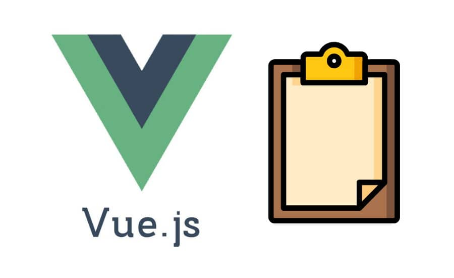
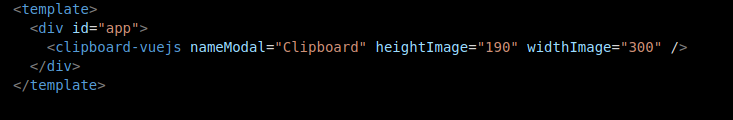
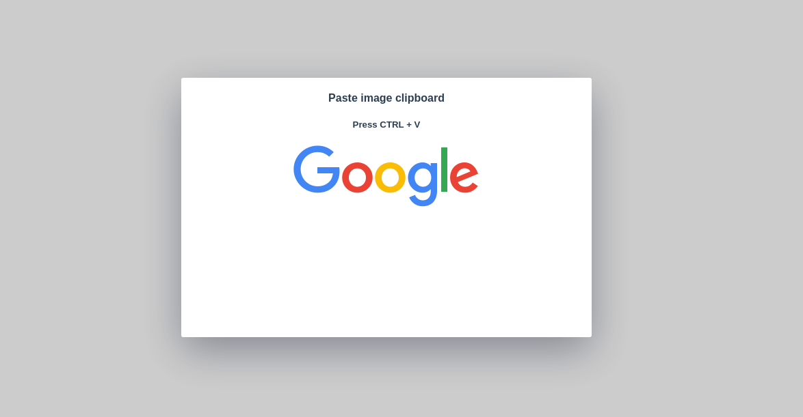

# Clipboard VueJS



<h2>
Documentation for use. 
Warning read this documentation!
</h2>
<h4>
Language English:

Clipboard copy and paste a image this lib is simple for use day of day.
This lib came up because of a problem, to render clipboard with control(CTRL) + v.
Pressing CTRL + V will open the modal, bringing what is on your clipboard.

```
nameModal="name for modal"
widthImage="width"
heightImage="height"
```
</h4>

<h2>
Documentação para uso.
Atenção leia a documentação!
</h2>

<h4>
Language Português-BR:

Copie e cole a imagem da área de transferência, esta lib é simples para uso no dia a dia.

Essa lib surgiu para solucionar um problema, renderizar clipboard com control(CTRL) + v

Ao pressionar control(CTRL) + v é aberto um modal, e este modal trás o que está na sua área de transferência.

```
nameModal="nome para o modal."
widthImage="tamanho"
heightImage="altura"
```
</h4>

Example for use component.
Exemplo para uso do componente.




Running component
Componente rodando.



## Project setup
```
npm install
```

### Compiles and hot-reloads for development
```
npm run serve
```

### Customize configuration
See [Configuration Reference](https://cli.vuejs.org/config/).
